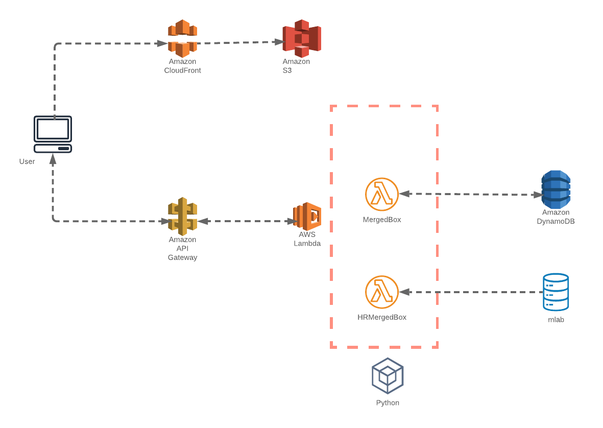

# Introduction

Proof of concept for app using FaaS approach.

## Current state

- App running using a mLab database with ~500.000 records linked with boxes ids.

## To be

- New re-boxing process that will merge two boxes into one.
- Reboxing will create a new box id but with a track of the boxes merged.
- It should be able to perform a query with the new box id and get the records related.

# App Model


for a process from a system that has a set of records linked to a main object called "boxes". After the migration the documents will be contained in a new box id. Information about the link of the new box id and the documents is needed.

## Environment variables

Environment variables for functions must be defined in the template.yaml file. You can define default values and create an alternative file (`env.json`) for a local debug.

### Environment json format file 
```json
{
  "Function": 
  { 
    "EnvVar": "EnvValue"
  } 
}
```

## Local debugging

The following commands allow you to perform a local debug using `vscode `, `sam-cli` and `docker`

- Build the function using the docker lambda python containers.
```bash 
sam build --use-container
```

- Start local api after a build using the environment file `env.json`
```bash
sam local start-api --env-vars env.json
# This command will use the .aws-sam/build directory, even you can change the files without reloading the api.
```
## Deployment Information

Once the build is performed it is located in `.aws-sam/build` directory with a subfolder per each function. In case that the function has 3rd party libraries it is necessary to create a package from this folder to deploy it. 

```bash
sam build --use-container
cd .aws-sam/build
sam package --template-file template.yaml --s3-bucket YOUR_S3_BUCKET --output-template-file packaged.yaml
sam deploy --region YOUR_REGION --template-file packaged.yaml --stack-name YOUR_STACK_NAME --capabilities CAPABILITY_IAM
```